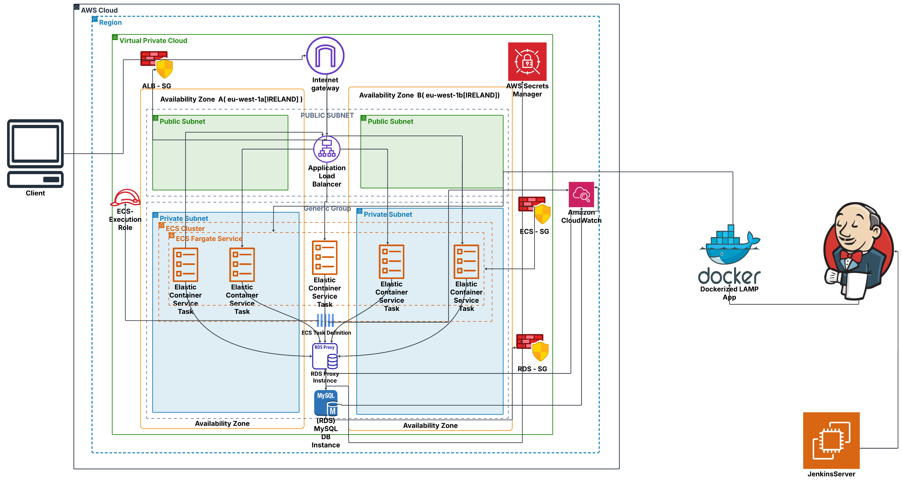
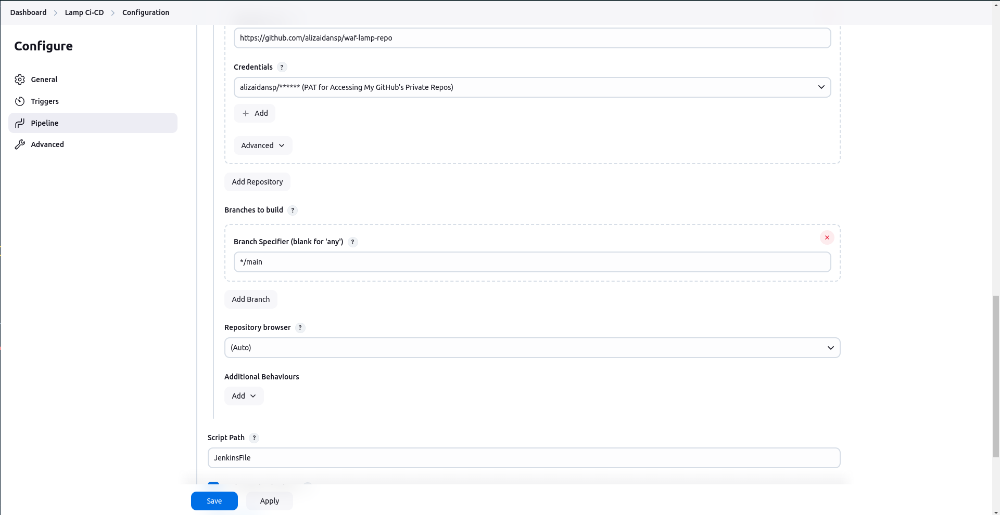
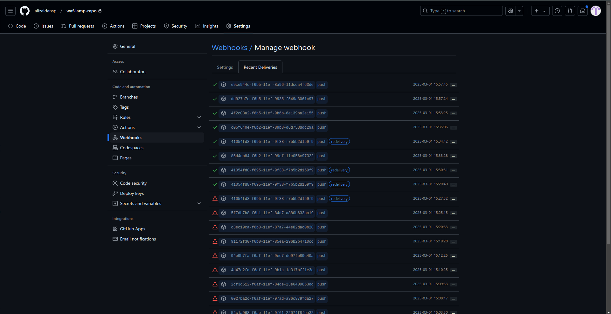
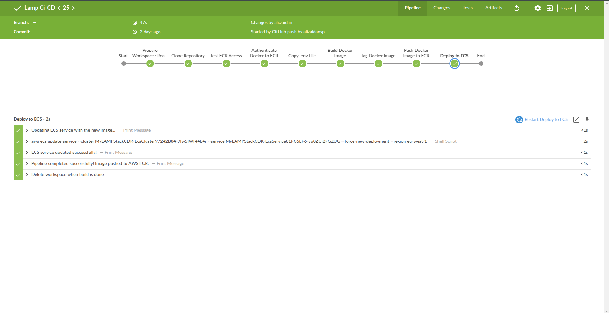

Below is the revised document with a detailed table of contents and well-structured sections covering the infrastructure overview, CDK deployment, Jenkins setup, and GitHub integration.

---

# Table of Contents

1. [LAMP Stack on AWS Well-Architected Framework (WAF)](#lamp-stack-on-aws-well-architected-framework-waf)  
   1.1. [Architecture Overview](#architecture-overview)  
   1.2. [Key Components](#key-components)  
   1.3. [Well-Architected Principles](#well-architected-principles)  

2. [Setup & Docker Deployment](#setup--docker-deployment)  
   2.1. [Prerequisites](#prerequisites)  
   2.2. [Build & Push Container](#build--push-container)

3. [AWS Infrastructure Deployment with CDK](#aws-infrastructure-deployment-with-cdk)  
   3.1. [CDK Deployment Steps](#cdk-deployment-steps)  
   3.2. [Post-Deployment Tasks](#post-deployment-tasks)

4. [Key Operational Features](#key-operational-features)  
   4.1. [Auto-Scaling Triggers](#auto-scaling-triggers)  
   4.2. [Monitoring](#monitoring)  
   4.3. [Security Best Practices](#security-best-practices)

5. [Jenkins Setup on Ubuntu EC2 with Docker and AWS CLI](#jenkins-setup-on-ubuntu-ec2-with-docker-and-aws-cli)  
   5.1. [EC2 Instance Prerequisites](#ec2-instance-prerequisites)  
   5.2. [Security Group Configuration](#security-group-configuration)  
   5.3. [IAM Role Configuration](#iam-role-configuration)  
   5.4. [Installing Jenkins](#installing-jenkins)  
   5.5. [Installing Docker](#installing-docker)  
   5.6. [Installing AWS CLI](#installing-aws-cli)  
   5.7. [Installing Blue Ocean Plugin](#installing-blue-ocean-plugin)  
   5.8. [Troubleshooting Jenkins and Docker](#troubleshooting-jenkins-and-docker)

6. [GitHub Integration with Jenkins for CI/CD Pipeline](#github-integration-with-jenkins-for-cicd-pipeline)  
   6.1. [Overview and Prerequisites](#overview-and-prerequisites)  
   6.2. [GitHub Personal Access Token Setup](#github-personal-access-token-setup)  
   6.3. [Jenkins Credentials Configuration](#jenkins-credentials-configuration)  
   6.4. [Pipeline Configuration](#pipeline-configuration)  
   6.5. [GitHub Webhook Configuration](#github-webhook-configuration)  
   6.6. [Dynamic IP Management](#dynamic-ip-management)  
   6.7. [Pipeline Verification](#pipeline-verification)  
   6.8. [Troubleshooting Pipeline Issues](#troubleshooting-pipeline-issues)

---

# LAMP Stack on AWS Well-Architected Framework (WAF)

A production-grade LAMP (Linux, Apache, MySQL, PHP) stack implementation on AWS leveraging the Well-Architected Framework. Built with AWS CDK, this infrastructure emphasizes security, scalability, reliability, and operational excellence.

## Architecture Overview

  


## Key Components

- **VPC**: Multi-AZ deployment with public and private subnets.
- **Security Groups**: Fine-grained network controls between ALB, ECS, RDS Proxy, and RDS.
- **Application Load Balancer (ALB)**: Distributes traffic across ECS tasks.
- **ECS Fargate**: Serverless compute for PHP/Apache containers with auto-scaling.
- **RDS MySQL**: Managed database with automated backups and CloudWatch logging.
- **RDS Proxy**: Connection pooling and secure database access.
- **Secrets Manager**: Secure credential storage for database access.
- **CloudWatch**: Centralized logging for ECS, RDS, and RDS Proxy.

## Well-Architected Principles

- **Security**: TLS-ready RDS Proxy, least-privilege IAM roles, encrypted secrets.
- **Reliability**: Multi-AZ deployment, auto-scaling, and health checks.
- **Performance**: Burstable RDS instance, Fargate CPU/memory optimization.
- **Cost Optimization**: Auto-scaling policies, managed spot instances (Fargate).
- **Operational Excellence**: Infrastructure-as-Code (CDK), CloudWatch monitoring.

---

# Setup & Docker Deployment

## Prerequisites

- AWS Account with CLI configured (`aws configure`)
- Docker installed
- Nodejs installed
- AWS CDK v2 installed (`npm install -g aws-cdk`)

## Build & Push Container

1. **Build Docker Image**:
   ```bash
   docker build -t my-lamp-app .
   ```

2. **Create ECR Repository** (if not existing):
   ```bash
   aws ecr create-repository --repository-name kstu-src-app-repo
   ```

3. **Authenticate Docker with ECR**:
   ```bash
   aws ecr get-login-password | docker login --username AWS --password-stdin YOUR_ACCOUNT_ID.dkr.ecr.YOUR_REGION.amazonaws.com
   ```

4. **Tag and Push Image**:
   ```bash
   docker tag my-lamp-app:latest YOUR_ECR_URI/kstu-src-app-repo:latest
   docker push YOUR_ECR_URI/kstu-src-app-repo:latest
   ```

---

# AWS Infrastructure Deployment with CDK

## CDK Deployment Steps

1. **Initialize CDK Project**:
   ```bash
   cdk init app --language=python
   ```
2. **Install Dependencies**:
   ```bash
   pip install -r requirements.txt
   ```
3. **Bootstrap CDK** (if first deployment):
   ```bash
   cdk bootstrap aws://YOUR_ACCOUNT_ID/YOUR_REGION
   ```

4. **Deploy Stack**:
   ```bash
   cdk deploy
   ```
5. **Use My Stack  From This Repo,and install the dependencies**:
   ```bash
   pip install -r requirements.txt
   ```
## Post-Deployment Tasks

1. **Access Application**:  
   Use the ALB DNS name output after deployment (`ALBURL`).

2. **Database Migrations**:
   ```bash
   aws ecs execute-command \
     --cluster <ClusterName> \
     --task <TaskID> \
     --container <Container Name From CDK> \
     --command "/bin/bash" \
     --interactive
   ```
   Then inside the container, migrate tables with:
   ```bash
   php artisan migrate --fresh
   ```

---

# Key Operational Features

## Auto-Scaling Triggers

- **CPU**: Scales out at 70% utilization.
- **Memory**: Scales out at 75% utilization.
- **Task Count**: Configured for 2-5 Fargate tasks.

## Monitoring

- **ECS**: Application logs available in CloudWatch (`ecs` log group).
- **RDS PROXY**: DB Proxy logs are sent to CloudWatch so you can easily monitor, troubleshoot, and audit database connections. This centralizes logging, enables alerting on issues, and helps correlate events across your AWS services.
- **RDS**: Error and slow query logs retained for 1 month.B**: Access logs can be enabled via CDK if required.

## Security Best Practices

- Database credentials are stored in AWS Secrets Manager.
- ECS tasks are launched without public IPs.

---

# Jenkins Setup on Ubuntu EC2 with Docker and AWS CLI

## EC2 Instance Prerequisites

- Ubuntu 22.04 LTS or later.
- Recommended specs:
  - t3.medium instance type (2 vCPU, 4GB RAM).
  - 20GB EBS storage.
  - Elastic IP assigned (optional but recommended for consistent access).
- IAM role attached: **JenkinsServerRole**.

## Security Group Configuration

Configure the EC2 security group to allow the following inbound traffic:

| Type        | Protocol | Port Range | Source    | Description           |
|-------------|----------|------------|-----------|------------------------|
| SSH         | TCP      | 22         | Your IP   | SSH access             |
| Custom TCP  | TCP      | 8080       | 0.0.0.0/0 | Jenkins web interface  |

*Note:* For production, restrict access to specific IP ranges instead of 0.0.0.0/0.

## IAM Role Configuration

The EC2 instance uses the **JenkinsServerRole** IAM role with an attached **JenkinsPolicies** policy. This policy enables Jenkins to:

- Work with Amazon ECR (push/pull Docker images).
- Interact with Amazon ECS (describe and update ECS services).

### (JenkinsPolicies) 
```json
{
    "Version": "2012-10-17",
    "Statement": [
        {
            "Sid": "AllowECRAccess",
            "Effect": "Allow",
            "Action": [
                "ecr:BatchCheckLayerAvailability",
                "ecr:GetDownloadUrlForLayer",
                "ecr:DescribeRepositories",
                "ecr:GetAuthorizationToken",
                "ecr:ListImages",
                "ecr:DescribeImages",
                "ecr:InitiateLayerUpload",
                "ecr:UploadLayerPart",
                "ecr:CompleteLayerUpload",
                "ecr:PutImage"
            ],
            "Resource": "*"
        },
        {
            "Sid": "AllowECSAccess",
            "Effect": "Allow",
            "Action": [
                "ecs:DescribeClusters",
                "ecs:DescribeServices",
                "ecs:UpdateService",
                "ecs:ListServices",
                "ecs:ListClusters"
            ],
            "Resource": "*"
        }
    ]
}
```

## Installing Jenkins

Connect to your EC2 instance via SSH and run:

```bash
# Update the system
sudo apt update
sudo apt upgrade -y

# Install Java
sudo apt install fontconfig openjdk-17-jre -y
java -version

# Add the Jenkins repository and install Jenkins
sudo wget -O /usr/share/keyrings/jenkins-keyring.asc \
  https://pkg.jenkins.io/debian-stable/jenkins.io-2023.key
echo "deb [signed-by=/usr/share/keyrings/jenkins-keyring.asc] https://pkg.jenkins.io/debian-stable binary/" | sudo tee /etc/apt/sources.list.d/jenkins.list > /dev/null
sudo apt update
sudo apt install jenkins -y

# Start and enable Jenkins service
sudo systemctl start jenkins
sudo systemctl enable jenkins

# Check Jenkins status and retrieve initial admin password
sudo systemctl status jenkins
sudo cat /var/lib/jenkins/secrets/initialAdminPassword
```

Access Jenkins by navigating to `http://<EC2-Public-IP>:8080`.

## Installing Docker

To install Docker:

```bash
# Install required packages
sudo apt install apt-transport-https ca-certificates curl software-properties-common -y

# Add Docker GPG key
curl -fsSL https://download.docker.com/linux/ubuntu/gpg | sudo gpg --dearmor -o /usr/share/keyrings/docker-archive-keyring.gpg

# Add the Docker repository
echo "deb [arch=$(dpkg --print-architecture) signed-by=/usr/share/keyrings/docker-archive-keyring.gpg] https://download.docker.com/linux/ubuntu $(lsb_release -cs) stable" | sudo tee /etc/apt/sources.list.d/docker.list > /dev/null

# Install Docker
sudo apt update
sudo apt install docker-ce docker-ce-cli containerd.io -y

# Add the Jenkins user to the Docker group and restart Jenkins
sudo usermod -aG docker jenkins
sudo systemctl restart jenkins

# Verify Docker installation
docker --version
```

## Installing AWS CLI

Install the AWS CLI as follows:

```bash
# Download the AWS CLI installer
curl "https://awscli.amazonaws.com/awscli-exe-linux-x86_64.zip" -o "awscliv2.zip"

# Install unzip if needed and unzip the installer
sudo apt install unzip -y
unzip awscliv2.zip

# Install AWS CLI
sudo ./aws/install

# Verify AWS CLI installation
aws --version
```

### Verifying IAM Role Configuration

Check access using:

```bash
# Check if the instance can access ECR
aws ecr describe-repositories

# Check if the instance can access ECS
aws ecs list-clusters
```

The IAM role automatically provides the necessary credentials.

## Installing Blue Ocean Plugin

Blue Ocean enhances Jenkins pipelines with a modern UI:

1. Open `http://<EC2-Public-IP>:8080` and log in.
2. Navigate to **Manage Jenkins** > **Manage Plugins** > **Available**.
3. Search for **Blue Ocean**, select it, and click **Install without restart**.
4. Optionally, restart Jenkins once installation completes.


After installation, access Blue Ocean at `http://<EC2-Public-IP>:8080/blue`.

## Troubleshooting Jenkins and Docker

### Jenkins Service Not Starting

```bash
sudo journalctl -u jenkins.service
java -version
sudo chown -R jenkins:jenkins /var/lib/jenkins
```

### Docker Permission Issues

```bash
# Verify Jenkins user membership in the docker group
groups jenkins

# If not present, add and restart services
sudo usermod -aG docker jenkins
sudo systemctl restart docker
sudo systemctl restart jenkins
```

### AWS CLI and IAM Role Issues

```bash
aws sts get-caller-identity
aws ecr describe-repositories
aws ecs list-clusters
```

### Security Group Issues

- Verify inbound rules in the AWS console.
- Ensure Jenkins is running: `sudo systemctl status jenkins`.
- Confirm that port 8080 is listening:
  ```bash
  sudo netstat -tulpn | grep 8080
  ```

---

# GitHub Integration with Jenkins for CI/CD Pipeline

## Overview and Prerequisites

This section details how to integrate a private GitHub repository with Jenkins to enable continuous integration and deployment.

**Prerequisites:**

- A running Jenkins server.
- Docker and AWS CLI installed on the Jenkins server.
- A GitHub account with administrative access to the repository.
- EC2 instance security group allowing inbound traffic on port 8080.

## GitHub Personal Access Token Setup

1. Log in to your GitHub account.
2. Navigate to **Settings** > **Developer settings** > **Personal access tokens** > **Generate new token**.
3. Select the **repo** scope for full control of private repositories.
4. Generate the token and copy it (note: it will be shown only once).

## Jenkins Credentials Configuration

1. Log in to your Jenkins server.
2. Navigate to **Manage Jenkins** > **Manage Credentials**.
3. Choose the appropriate domain (typically **global**).
4. Click **Add Credentials** and configure as follows:
   - **Kind**: Username with password.
   - **Username**: Your GitHub username.
   - **Password**: Your GitHub Personal Access Token.
   - **ID**: For example, `github-pat`.
   - **Description**: "GitHub Personal Access Token".
5. Save the configuration.

## Pipeline Configuration

1. From the Jenkins dashboard, click **New Item**.
2. Enter a name for your pipeline and select **Pipeline**.
3. Click **OK**.
4. Scroll down to the **Pipeline** section:
   - Choose **Pipeline script from SCM**.
   - Select **Git** as the SCM.
   - Enter your repository URL (e.g., `https://github.com/alizaidansp/waf-lamp-repo.git`).
   - Select the GitHub credentials you created.
   - Specify the branch (e.g., `*/main` or `*/master`).
   - Set the **Script Path** to `Jenkinsfile`.
5. Save the configuration.

  

## GitHub Webhook Configuration

1. In your GitHub repository, navigate to **Settings** > **Webhooks** > **Add webhook**.
2. Configure the webhook:
   - **Payload URL**: `http://<jenkins_server_ip>:8080/github-webhook/`
   - **Content type**: `application/json`
   - **Secret**: (Optional) Define a secret token.
   - **Trigger**: Choose the **push event** (or customize as needed).
   - Ensure the webhook is **Active**.
3. Click **Add webhook**. GitHub will send a test ping to verify connectivity.

  


## Dynamic IP Management

If your EC2 instance does not use an Elastic IP address, update the Jenkins URL after an IP change:

1. Edit the Jenkins configuration file:
   ```bash
   sudo nano /var/lib/jenkins/jenkins.model.JenkinsLocationConfiguration.xml
   ```
2. Modify the `<jenkinsUrl>` element with the new public IP:
   ```xml
   <jenkinsUrl>http://<new_public_ip>:8080/</jenkinsUrl>
   ```
3. Save the file and restart Jenkins:
   ```bash
   sudo systemctl restart jenkins
   ```
4. Update the webhook URL in GitHub accordingly.

5. Don't forget  to update the Jenkins file's     ECS_CLUSTER = "<CLUSTER_NAME>" and  # ECS_SERVICE = "<SERVICE_NAME>"  each time you deploy your infrastructure

## Pipeline Verification

### Verify GitHub Connection

- In Jenkins, click **Build Now** in your pipeline project.
- Check the console output to ensure Jenkins is accessing the repository and reading the `Jenkinsfile`.

### Verify Webhook Connection

- Make a small change to your GitHub repository and push it.
- Confirm that Jenkins triggers a new build.
- Review the webhook delivery history in GitHub under **Settings** > **Webhooks** > **Recent Deliveries**.

### Pipeline Execution Screenshot

  


## Troubleshooting Pipeline Issues

1. **Webhook Not Triggering Builds**  
   - Verify the webhook URL and content type.
   - Check Jenkins logs for webhook events.
   - Ensure your EC2 security group permits traffic on port 8080.

2. **Jenkins Cannot Access Private Repository**  
   - Validate that the GitHub credentials are correctly set up.
   - Confirm the PAT is active and has necessary scopes.
   - Check network connectivity between Jenkins and GitHub.

3. **Jenkinsfile Not Found**  
   - Confirm the correct Jenkinsfile path in your pipeline configuration.
   - Ensure the file exists and matches the expected case (e.g., `Jenkinsfile` vs `jenkinsfile`).

---

